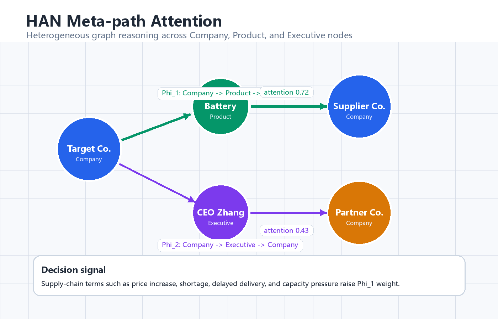
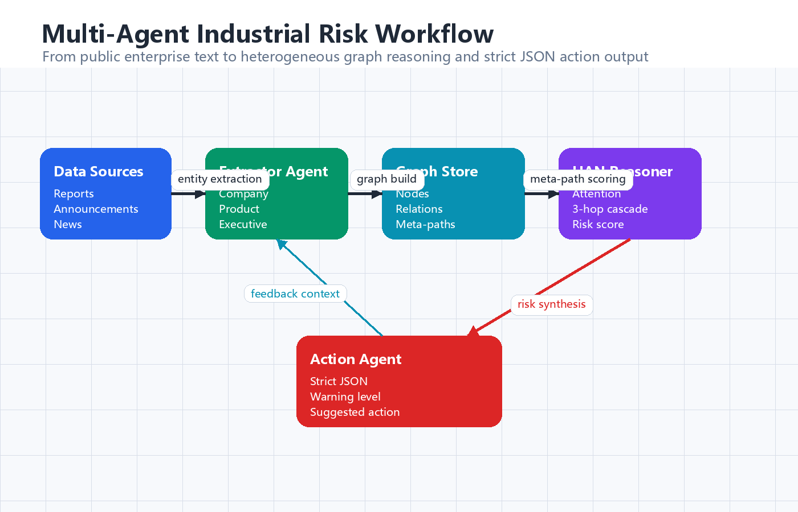
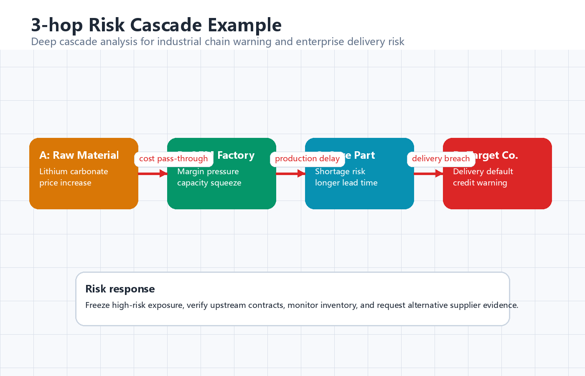

# Enterprise-HAN-Agent: 多维产业分析与决策中枢


## 项目简介

传统企业风控依赖单一维度的数据堆砌，难以穿透复杂产业链中的级联风险。本项目构建了一个基于 Multi-Agent 协作的智能决策系统，底层对齐 **Heterogeneous Graph Attention Networks (HAN)** 的元路径推理机制，使大语言模型具备处理多维业务逻辑和隐秘长链关联的能力。

当前代码包提供一个无外部依赖的可运行基线，定位为原型验证和初级落地版本：从非结构化中文企业事件中抽取 `Company`、`Executive`、`Product` 三类节点，构建异构图关系，并沿 `Company -> Product -> Company`、`Company -> Executive -> Company` 等元路径输出严格 JSON 风险结论。

项目后续会升级为长期协作型 Agent Harness 架构，通过统一编排层管理数据抓取、任务拆解、监督校验、自适应反馈、图谱更新和模型动态训练，使系统从单次分析工具逐步演进为可持续运行的企业风险决策中枢。

## 目录结构

```text
Enterprise-HAN-Agent/
  assets/
    agent_workflow.png
    han_metapath_visualization.png
    risk_cascade_example.png
  examples/sample_event.txt
  prompts/risk_modeling_agent.md
  schemas/risk_output.schema.json
  scripts/generate_assets.py
  src/enterprise_han_agent/
    extraction.py
    graph.py
    reasoning.py
    agents.py
    pipeline.py
    cli.py
```

## 快速运行

```bash
python -m venv .venv
source .venv/bin/activate
pip install -e .
enterprise-han-agent --input examples/sample_event.txt --target-company 海川汽车股份有限公司 --pretty
```

Windows PowerShell:

```powershell
python -m venv .venv
.\.venv\Scripts\Activate.ps1
pip install -e .
enterprise-han-agent --input examples\sample_event.txt --target-company 海川汽车股份有限公司 --pretty
```

也可以不安装，直接用源码目录运行：

```powershell
$env:PYTHONPATH="src"
python -m enterprise_han_agent --input examples\sample_event.txt --target-company 海川汽车股份有限公司 --pretty
```

## 输出格式

系统严格输出以下 JSON，字段定义见 `schemas/risk_output.schema.json`。

```json
{
  "target_company": "海川汽车股份有限公司",
  "risk_score": 9,
  "primary_meta_path": "Company -> Product -> Company (供应链级联传导路径)",
  "cascade_reasoning_chain": [
    "Step 1: 海川汽车股份有限公司 -> 核心部件 (Depends_on; 证据: ...)",
    "Step 2: 核心部件 -> 远桥电池科技有限公司 (Depends_on; 证据: ...)"
  ],
  "suggested_action": "触发红色预警..."
}
```

## 核心技术逻辑：图谱驱动的深度推理

本项目不仅是简单 RAG，而是将 Agent 的思考链与 HAN 的注意力机制对齐。

### 1. 节点级注意力

Agent 识别特定元路径 `Phi` 下，相邻节点对目标节点的影响力。系统可对接如下注意力计算逻辑，并将高权重路径注入 Prompt 或后端决策链：

```text
alpha_ij^Phi =
  exp(LeakyReLU(a_Phi^T [h_i' || h_j']))
  / sum_k exp(LeakyReLU(a_Phi^T [h_i' || h_k']))
```

### 2. 当前多 Agent 协作流

- **Data Extractor Agent:** 负责合规公开数据采集与解析，提取企业、产品、原材料、高管等异构节点。
- **HAN-Reasoning Agent:** 挂载图数据库或本地异构图，沿 `企业-产品-企业`、`企业-高管-企业` 等元路径进行长链推理。
- **Action Agent:** 将推理出的风险图谱转化为具体的业务预警 JSON。

### 3. 未来 Agent Harness 架构

未来版本将从简单 Pipeline 升级为可长期运行的 Agent Harness。Harness 层会负责统一调度和治理，不只调用单个 Agent，而是管理完整的任务生命周期：

- **Task Manager:** 维护企业池扫描、数据抓取、图谱更新、模型训练、风险复核和报告生成等任务队列，并根据风险等级动态调整优先级。
- **Supervisor Agent:** 对关键推理结果进行监督，检查幻觉、证据缺失、异常评分和不一致结论，并将失败任务重新分发或触发人工复核。
- **Data Extractor Agent:** 面向公告、财报、研报、新闻舆情、招投标和供应链数据进行持续解析，形成可追溯的结构化事实。
- **Graph Builder Agent:** 动态维护异构产业知识图谱，持续更新企业、产品、高管、供应关系、投资关系和管理关系。
- **HAN Reasoning Agent:** 基于元路径注意力进行 3-hop 以上风险穿透，识别供应链、治理结构和关联交易中的隐性风险。
- **Training Agent:** 根据新增样本、人工反馈和真实风险事件动态更新节点权重、关系权重、行业参数和风险评分模型。
- **Action Agent:** 自动生成风险预警、风控报告、处置建议和标准化 JSON/API 输出。
- **Adaptive Feedback Loop:** 将人工复核、真实风险事件、误判样本和新增行业数据回流到图谱与训练流程，实现数据自清洗、模型自校准、策略自优化和流程自净化。

```text
[Public / Licensed Data Sources]
公告 / 财报 / 研报 / 新闻舆情 / 招投标 / 供应链数据 / 工商数据
        |
        v
+--------------------------------------------------+
| Agent Harness Layer                              |
| 编排调度 / 权限控制 / 状态追踪 / 异常监督 / 日志审计 |
+--------------------------------------------------+
        |
        v
+----------------------+        +----------------------+
| Task Manager         | <----> | Supervisor Agent     |
| 任务队列             |        | 质量监督             |
| 优先级调度           |        | 幻觉检测             |
| 失败重试             |        | 异常任务回滚         |
| 进度追踪             |        | 人工复核触发         |
+----------------------+        +----------------------+
        |
        v
+----------------------+
| Data Extractor Agent |
| 公告解析 / 财报解析   |
| 舆情抓取 / 实体抽取   |
+----------------------+
        |
        v
+----------------------+
| Graph Builder Agent  |
| Company / Product    |
| Executive / Relation |
+----------------------+
        |
        v
+----------------------+
| HAN Reasoning Agent  |
| 元路径注意力推理     |
| 3-hop+ 风险穿透      |
+----------------------+
        |
        v
+----------------------+
| Training Agent       |
| 风险权重更新         |
| 样本增量训练         |
| 模型动态校准         |
+----------------------+
        |
        v
+----------------------+
| Action Agent         |
| 风险预警 / 报告生成   |
| JSON / API 输出      |
+----------------------+
        |
        v
+--------------------------------------------------+
| Adaptive Feedback Loop                           |
| 人工复核 / 真实风险事件 / 误判样本 / 新行业数据       |
| 数据自清洗 / 模型自校准 / 策略自优化 / 流程自净化      |
+--------------------------------------------------+
        |
        +---------------------> 回流 Task Manager / Graph / Training
```

## 系统架构图与可视化展示

### 1. 多维异构图谱与元路径注意力



图中展示公司节点、产品节点、高管节点如何通过不同类型边连接，以及不同颜色代表的注意力权重分布。

### 2. Agent 协作与数据流向



图中展示从非结构化文本输入，到多 Agent 提取实体，再到图数据库长链推理和结构化 JSON 输出的闭环。

### 3. 3-hop 风险级联推演



图中展示 `A 原材料涨价 -> B 代工厂利润受压 -> C 核心部件短缺 -> D 目标企业交付违约` 的三跳以上风险传导链。

图片由 `scripts/generate_assets.py` 生成，可按申报材料风格继续调整。

## 后续扩展

- 将 `RuleBasedExtractor` 替换为 LLM 工具调用或中文 NER 模型。
- 将 `HeterogeneousGraph` 替换为 Neo4j、NebulaGraph 或 TigerGraph。
- 将 `HANReasoner.score_metapaths` 替换为 PyTorch Geometric HAN 模型输出的真实元路径注意力权重。
- 将 `prompts/risk_modeling_agent.md` 注入 OpenClaw、AutoGen、LangGraph 或企业内部 Agent 编排框架。
- 引入 Supervisor Agent、Task Manager 和 Adaptive Feedback Loop，形成可长期运行、可审计、可复盘的 Agent Harness。
- 接入增量训练与自动评估流程，使产业图谱、风险评分和处置策略能够随真实业务反馈持续迭代。

## Token Plan

本项目当前处于原型验证和初级落地阶段，Token 消耗主要集中在样本文本解析、元路径推理、报告生成和少量人工复核场景。随着后续升级为长期协作型 Agent Harness，系统将需要持续处理海量非结构化文本、多轮图谱更新、多 Agent 协同推理、动态训练、监督校验和自动报告生成。

在规模化部署后，预计日均 Token 消耗量约为 **1 亿到 2 亿 Token**；当开启全量企业池扫描、实时舆情监控、跨行业供应链穿透分析和集中报告生成时，峰值消耗预计可达到 **3 亿 Token 左右**。实际消耗会随数据源数量、企业覆盖范围、上下游穿透深度、模型训练频率和监督复核比例动态变化。
